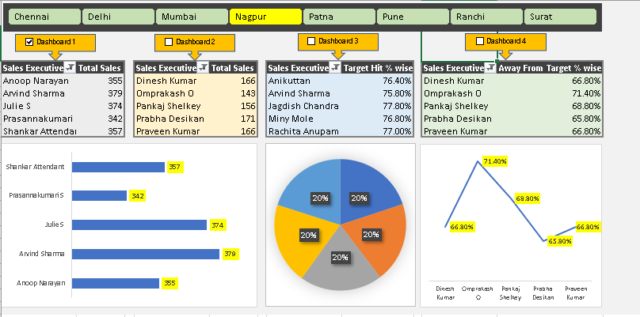
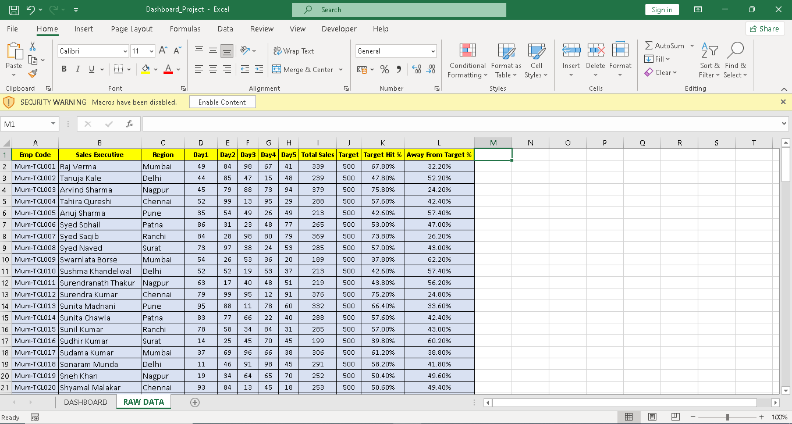

# 📊 Excel Sales Dashboard Project  
### *By Mayank Kapoor*

## 📌 Project Overview  
This project is an interactive **Excel Sales Dashboard** designed to analyze performance across multiple regions such as Mumbai, Delhi, Nagpur, Patna, Pune, Ranchi, and Surat.

The dashboard presents key insights through dynamic charts, KPIs, and filters, making it useful for business decision-making and performance tracking.

---

## 📁 Dataset Information  
The dataset includes the following fields:

- Employee Code  
- Sales Executive  
- Region  
- Daily Sales (Day 1–Day 5)  
- Total Sales  
- Target  
- Target Hit %  
- Away From Target %

---

## 🛠 Tools & Techniques Used  

- **Microsoft Excel**  
- **Pivot Tables**  
- **Pivot Charts**  
- **Data Validation & Slicers**  
- **Conditional Formatting**  
- **Excel Formulas Used:**  
  - SUM, AVERAGE  
  - IF  
  - VLOOKUP / XLOOKUP  
  - SUMIFS  

---

## 📸 Dashboard Preview  

```md


